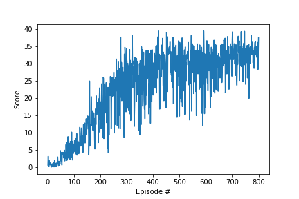

# Project Report

## Learning Algorithm

The agent is implemented with a basic Deterministic Policy Gradient (DPG) algorithm.

## Network Structure and Hyper Parameters

#### Actor network

- 1 hidden layer of size `256`

#### Critic network

- 1 fully connected layer of size `256` for state encoding
- encoded state and action concatenation
- 2 fully connected layers of size `[256, 128]` respectively

#### Hyper parameters

|Hyper Parameters|Value|
|---|----|
|Discount factor $\gamma$| `0.99`|
|Actor learning rate $\alpha_a$|`1e-4`|
|Critic learning rate $\alpha_c$|`1e-4`|
|Soft update rate $\tau$|`1e-2`|
|Weight decay $\lambda$|`0.0001`|

A size of `1e6` for the memory buffer, and a batch size of `128` for experience replay sampling are used. The target network is soft-updated every `4` steps.

## Score Visualization

Average score vs. Episode

After 1000 episodes, the average score plateued about 23. The max score has been under 28. The model was not able to achieve a score of 30+. 

## Future Improvements

I suspect underfitting by the actor network. Though after increasing the depth of actor network, the agent failed to learn steadily. The underperformance could also attribute to the model's converging to local optimum. I could use n-step bootstrapping or generalized advantage estimation and prioritized experience replay to improve exploration.