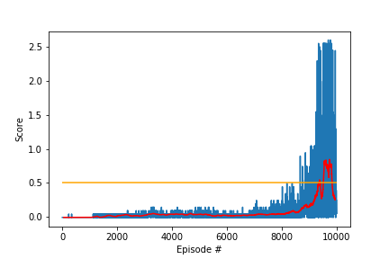
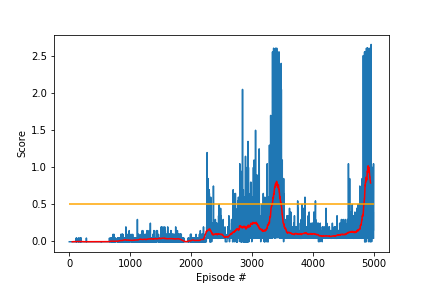

# Project Report

## Learning Algorithm

The agent is implemented with a basic Multi-Agent Deep Deterministic Policy Gradient (DDPG) algorithm. Since the observation is local, and a good policy for one agent should work equally well for the other, both agents are controlled by the same DDPG module, with a shared experience memory.

### DDPG Algorithm

The DDPG consists of an actor and a critic. The actor's function outputs a deterministic action, instead of a distribution of actions, and the critic's function approximates the $Q$ value of state-action pairs, $Q(s, a)$. Parameters in the critic are updated with TD-learning, the loss function being the mean squared error between expected $Q$ value and target $Q$ value:

$$
loss_{critic} = |r+\gamma Q(s_{t+1}, a_{t+1}) - Q(s_t ,a_t)|^2.
$$

Parameters in the actor are optimized for maximum total expected return $J$. Following the derivation of [*Lillicrap, et al. 2016*](https://arxiv.org/abs/1509.02971), 

$$
\nabla_\theta J \propto \nabla_\theta Q(s, \mu(s|\theta)),
$$

where $\mu$ is the deterministic policy parameterized by $\theta$. Thus, the loss function for the actor can be reduced to $-Q(s, \mu(s))$ without losing quality.

To have better stability, both the actor and the critic employ a target network and a local network.

### Prioritized Experience Replay

The agent stores the experience in a memory buffer whenever it encounters a new piece of experience tuple, namely $s, a, r, s', d$, where $s$ is a state, $a$ the action on the state, $s'$ the next state after action, and $d$ a flag denoting whether the game has reached the terminal state. Considering that the experience tuples that depict higher errors are more helpful for time-dependent (TD) update, it is advantageous to sample these experiences more frequently during experience replay. 

The probability for an experience to be sampled, subject to normalization, is designed to be

$$
p \propto (|\delta|+\epsilon)^\alpha
$$

where $\alpha$ is a constant exponent, and $\delta$ is the TD error. $\epsilon$ is a small constant that prevents a "perfect" experience with $0$ from never being selected. To correct the bias introduced by non-uniform sampling, a weight term is applied to the error during parameter update, defined as:

$$
w = \left( N p\right)^{-\beta}
$$

Here $N$ is the total number of experiences, and $\beta$ is a positive number. For stability, $w$ is always normalized by their max value across all experiences. The uniformity is restored when $\beta=1$, as the $p$ term is cancelled. Thus we would like $\beta=1$ when the training eventually converges. $\beta$ is set to linearly change toward $1$ in this task. For more on Prioritiezed Experience Replay, see the original paper [*Schaul et al. 2015*](https://arxiv.org/abs/1511.05952) .

## Network Structure and Hyper Parameters

#### Actor network

- 1 hidden layer of size `128`

#### Critic network

- 1 fully connected layer of size `128` for state encoding
- encoded state and action concatenation
- 1 fully connected layers of size `128`

#### Hyper parameters

##### DDPG Agent

|Hyper Parameters|Value|
|---|----|
|Discount factor $\gamma$| `0.99`|
|Actor learning rate $\alpha_a$|`1e-4`|
|Critic learning rate $\alpha_c$|`1e-4`|
|Soft update rate $\tau$|`1e-2`|
|Weight decay $\lambda$|`0`|
|Replay buffer size|`1e5`|
|Batch size|`1024`|
|Max episode length|`1000`|

##### Prioritized Memory

|Hyper Parameters|Value|
|---|---|
|$\alpha$|`0.6`|
|$\beta$|`0.4`|
|$\beta$ increment|`0.0001`|

## Score Visualization

Before applying PER, it took much longer to find positive feedbacks. 

**Average score vs. Episode (without PER)**

**Average score vs. Episode (with PER)**

It can be seen that the average score over 100 steps has reached above 0.5 only after 9000 without PER, but at about 3300 earlest with PER. An early-stopping switch is added in the code to save the best checkpoints in terms of average score.

Note that instead of using the higher score of the two agents as performance metric of the game, I used the average, which is less or equal to the higher score. This implies that whenever the environment is considered "solved" in this alternative metric, it is solved by the original standard as well.

## Future Improvements

N-step bootstrapping or generalized advantage estimation and prioritized experience replay could be used to improve stability. 