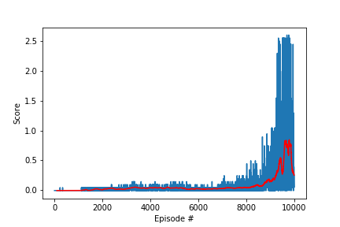

# Project Report

## Learning Algorithm

The agent is implemented with a basic Multi-Agent Deep Deterministic Policy Gradient (DDPG) algorithm. Since the observation is local, and a good policy for one agent should work equally well for the other, both agents are controlled by the same DDPG module, with a shared experience memory.

### DDPG Algorithm

The DDPG consists of an actor and a critic. The actor's function outputs a deterministic action, instead of a distribution of actions, and the critic's function approximates the $Q$ value of state-action pairs, $Q(s, a)$. Parameters in the critic are updated with TD-learning, the loss function being the mean squared error between expected $Q$ value and target $Q$ value:

$$
loss_{critic} = |r+\gamma Q(s_{t+1}, a_{t+1}) - Q(s_t ,a_t)|^2.
$$

Parameters in the actor are optimized for maximum total expected return $J$. Following the derivation of [*Lillicrap, et al. 2016*](https://arxiv.org/abs/1509.02971), 

$$
\nabla_\theta J \propto \nabla_\theta Q(s, \mu(s|\theta)),
$$

where $\mu$ is the deterministic policy parameterized by $\theta$. Thus, the loss function for the actor can be reduced to $-Q(s, \mu(s))$ without losing quality.

To have better stability, both the actor and the critic employ a target network and a local network.

### Prioritized Experience Replay

The agent stores the experience in a memory buffer whenever it encounters a new piece of experience tuple, namely $s, a, r, s', d$, where $s$ is a state, $a$ the action on the state, $s'$ the next state after action, and $d$ a flag denoting whether the game has reached the terminal state. Considering that the experience tuples that depict higher errors are more helpful for time-dependent (TD) update, it is advantageous to sample these experiences more frequently during experience replay. 

The probability for an experience to be sampled, subject to normalization, is designed to be

$$
\p \propto (|\delta|+\epsilon)^\alpha
$$

where $\alpha$ is a constant exponent, and $\delta$ is the TD error. $\epsilon$ is a small constant that prevents a "perfect" experience with $0$ from never being selected. To correct the bias introduced by non-uniform sampling, a weight term is applied to the error during parameter update, defined as:

$$

$$

## Network Structure and Hyper Parameters

#### Actor network

- 1 hidden layer of size `256`

#### Critic network

- 1 fully connected layer of size `256` for state encoding
- encoded state and action concatenation
- 2 fully connected layers of size `[256, 128]` respectively

#### Hyper parameters

|Hyper Parameters|Value|
|---|----|
|Discount factor $\gamma$| `0.99`|
|Actor learning rate $\alpha_a$|`1e-4`|
|Critic learning rate $\alpha_c$|`1e-4`|
|Soft update rate $\tau$|`1e-2`|
|Weight decay $\lambda$|`0.0001`|
|Replay buffer size|`1e6`|
|Batch size|`1024`|
|Max episode length|`1000`|

## Score Visualization

Average score vs. Episode

After 800 episodes, the average score reached above 30. The max score is 30.54. Increasing the max epoisode length to 1000 seems to have fixed the previous problem that the average score plateued at a lower value. 

## Future Improvements

N-step bootstrapping or generalized advantage estimation and prioritized experience replay could be used to improve stability.